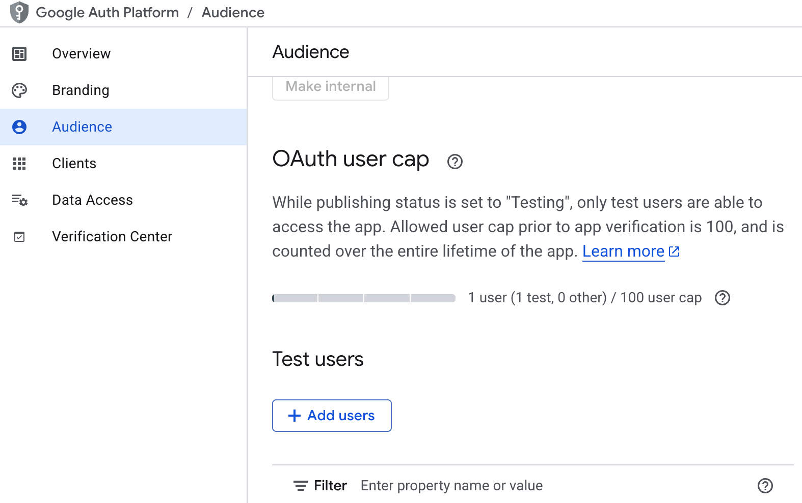
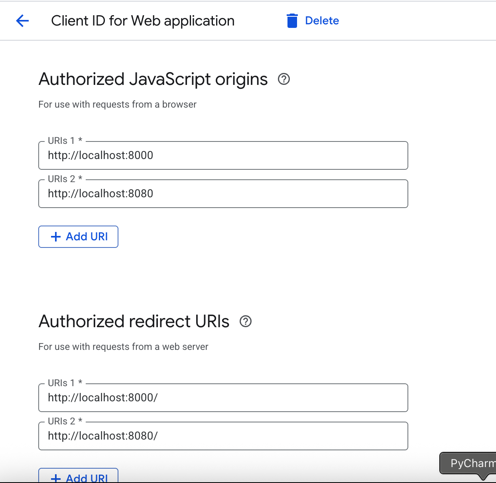

# MCP GMAIL

A Python package exposing Gmail over the Model Context Protocol (MCP) for LLM RAG and document collaboration.

## Features

* OAuth2 authentication with built-in token caching
* List, search, read Gmail messages
* Download and optionally decrypt ZIP/PDF attachments with runtime password
* Fully configurable via environment variables
* CLI entrypoint (`mcp_gmail serve`) for easy startup
* Uses FastMCP and SSE transport for LLM integration

## Installation

Clone the repository and install in editable mode:

```bash
git clone https://github.com/varunajmera0/mcp_gmail.git
cd mcp_gmail
pip install -e .
```

## Configuration

1. Copy the example environment file:

   ```bash
   cp .env.example .env
   ```
2. Edit `.env` to fit your setup:

   ```dotenv
    GMAIL_CREDENTIALS_PATH=credentials.json
    GMAIL_TOKEN_PATH=token.json
    GMAIL_OAUTH_PORT=8080
    MCP_TRANSPORT=sse
    MCP_SERVER_HOST=localhost
    MCP_SERVER_PORT=8000
    SCOPES=https://www.googleapis.com/auth/gmail.modify
    ATTACHMENT_SAVE_DIR=attachments
    ENABLE_PDF_DECRYPTION=true
    BASE_URL_PROTOCOL=http
   ```
3. In Google Cloud Console:

   * Go to APIs & Services → Library, search for Gmail API, and click Enable. 
   * Then go to APIs & Services → Credentials and click Create Credentials → OAuth client ID. 
   * Select Desktop app, give it a name, and click Create. 
   * Download the JSON and save it as credentials.json in your project root. 
   * Under your new client’s settings, add the redirect URI: `http://localhost:8080/` and `http://localhost:8000/`. 
   * If using an External app, open OAuth consent screen, add your Google account under Test users, or publish the app., add your Google account under Test users, or publish the app.
   
   
   
## Usage

### Start the MCP server

```bash
mcp_gmail serve
```

This serves an SSE endpoint at:

```
<BASE_URL_PROTOCOL>://<MCP_SERVER_HOST>:<MCP_SERVER_PORT>/sse
```

### Python client example
in examples folder


## Contributing

1. Fork the repository
2. Create a new branch (`git checkout -b feat/my-feature`)
3. Commit your changes (`git commit -m "Add feature"`)
4. Push your branch (`git push origin feat/my-feature`)
5. Open a Pull Request
